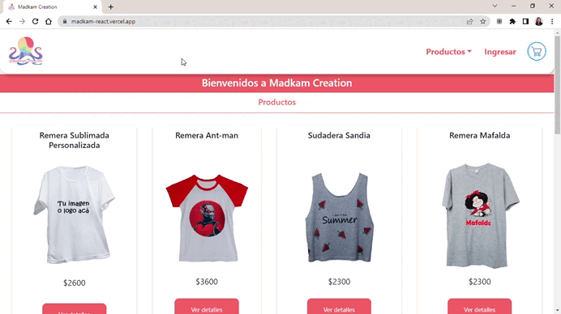

<h1 align="center">
  <br>
  </a>
  <br>
  madkam creation
  <br>
</h1>
<h3 align="center">Mi tienda online con React</3>

<br>


<p align="center">
  <a href="#como-ejecutar-el-proyecto">Ejecutar el proyecto</a> • <a href="#creditos">Creditos</a>
</p>



## Como ejecutar el proyecto

Para clonar este ecommerce, necesitarás [Git](https://git-scm.com) y [Node.js](https://nodejs.org/en/download/) (que biene con [npm](http://npmjs.com)) instalados en tu computador. 
La línea de comandos es la siguiente:

```bash
# Clonar el respositorio
$ git clone https://github.com/aldykarina/madkam-react.git

# Ir al repositorio
$ cd madkam_vite--app

# Instalar dependencias
$ npm install

# Correr la app
$ npm start
```

## Creditos

Este proyecto utiliza los siguientes paquetes de código, frameworks y librerias:

- [Node.js](https://nodejs.org/)
- [Bootstrap](https://getbootstrap.com/)
- [React-Toastify](https://www.npmjs.com/package/react-toastify) usado para notificar al usuario se agregó un producto al carrito.
- [sweetalert2-react-content](https://github.com/sweetalert2/sweetalert2-react-content) usado dar alertas con estilo con información para el usuario.


> GitHub [@aldykarina](https://github.com/aldykarina/madkam-react.git) &nbsp;&middot;&nbsp;


